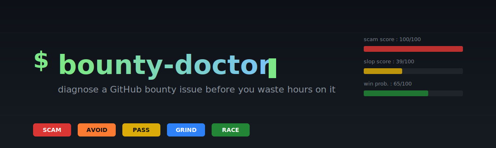

<p align="center">
  
</p>

<p align="center">
  <a href="https://www.npmjs.com/package/bounty-doctor"></a>
  <a href="https://github.com/cnguyen14/bounty-doctor/blob/main/LICENSE"></a>
  <a href="https://github.com/cnguyen14/bounty-doctor/stargazers"></a>
  
  <a href="https://github.com/sponsors/cnguyen14"></a>
</p>

<p align="center">
  <b>Diagnose a GitHub bounty issue <i>before</i> you waste hours on it.</b><br/>
  Detects honeypot scam repos, AI-bot attempt swarms, and stale contests.
</p>

```sh
npx bounty-doctor https://github.com/<owner>/<repo>/issues/<n>
```

The 2026 Algora bounty market is hostile to first-time contributors. Devin AI auto-posts PRs. CashClaw advertises itself as an autonomous agent. Repos like `orchestration-agent/AgentOrchestration` flood GitHub with $2k–$9k "good first issue" labels that **will never pay out**. This tool tells you, in 5 seconds, whether an issue is worth your evening.

## Verdicts at a glance

| Verdict | When you'll see it | What to do |
|---|---|---|
|  | Honeypot patterns detected (bulk fake bounties, "good first issue" + $1k+, archived repo). | Walk away. The bounty will never pay out. |
|  | Bot swarm or lottery-level competition; win probability under 20%. | Don't spend time. Pick something else. |
|  | Possible, but odds are unfavorable. | Only attempt if you'd do the work for free anyway. |
|  | Tractable but contested; quality wins over speed. | Write a clean PR with a demo video. Engage the maintainer. |
|  | Fresh bounty, low competition, real maintainer. | Move fast. Ship a clean first PR ASAP. |

## What it checks

1. **Honeypot patterns** — repos with bulk fake bounties (`[ Bounty $Xk ] [ Section ]` title pattern, "good first issue" + crypto-eligible + $1k+ combos, dozens of identical-shape issues), archived repos, repos with issues disabled.
2. **Bot/AI swarm** — counts `/attempt` and `/claim` comments, detects AI-generated boilerplate ("Plan: …", "I'll keep this narrow…"), known integrations (Devin, CashClaw, OpenHands, Codex), and shared wallet addresses across users (farm signature).
3. **Saturation** — bounty age, # unique attempters per dollar, days since last attempt, plausibility of getting paid.

It then prints a **verdict**: `SCAM`, `AVOID`, `PASS`, `GRIND`, or `RACE`.

## Examples

A real honeypot (synthetic-token bounty farm):

```
$ bounty-doctor https://github.com/Scottcjn/rustchain-bounties/issues/12419

Honeypot check
  scam score : 75/100 ███████████████░░░░░  (scam)
             • Title shape "[Bounty Claim|Submit|...]" in a 3897-open-issue "bounty"-named repo — classic synthetic-token farm
             • Repo named "Scottcjn/rustchain-bounties" has 3897 open issues — bounty-board scale signals token-airdrop farm, not real payouts

Verdict
    SCAM   Honeypot or fake-bounty farm. Walk away.
```

A real but heavily contested bounty:

```
$ bounty-doctor https://github.com/tscircuit/pcb-viewer/issues/163

Bot/AI swarm
  slop score : 39/100 ████████░░░░░░░░░░░░
  attempts   : 23 comments from 19 unique users
             • known bots seen: CashClaw autonomous agent

Win probability
  estimate   : 10% ██░░░░░░░░░░░░░░░░░░
             • 19 attempters — lottery-level competition, win rate ≈ 5%.

Verdict
    AVOID   Already lost. Bot swarm or dead repo. Don't spend time.
```

A real bounty worth a shot:

```
$ bounty-doctor https://github.com/apify/fingerprint-suite/issues/6

Bounty
  amount     : $30
  posted     : 579 days ago

Bot/AI swarm
  slop score : 9/100 ██░░░░░░░░░░░░░░░░░░
  attempts   : 1 comments from 1 unique users

Win probability
  estimate   : 40% ████████░░░░░░░░░░░░
             • Only 1 attempters — moderate competition.

Verdict
    GRIND   Tractable with high-quality PR + demo video. Quality wins over speed here.
```

## Install

```sh
npm install -g bounty-doctor
# or one-shot
npx bounty-doctor <url>
```

Node 18+.

## Auth

Public GitHub API has a strict unauthenticated rate limit. The CLI looks for a token in:

1. `GITHUB_TOKEN` env var
2. `gh auth token` (GitHub CLI)

Either is fine — read-only access to public issues is all that's needed.

## Output formats

```sh
bounty-doctor <url>          # pretty terminal report (default)
bounty-doctor <url> --json   # machine-readable JSON for piping
```

Exit code:
- `0` — verdict was `RACE`, `GRIND`, or `PASS`
- `1` — error (network, parse, etc.)
- `2` — verdict was `SCAM` or `AVOID` (useful for CI / scripts)

## Library use

```ts
import { diagnose } from "bounty-doctor";

const report = await diagnose("owner/repo#123");
if (report.verdict === "SCAM" || report.verdict === "AVOID") {
  process.exit(2);
}
console.log(report.saturation.winProbabilityPct);
```

## What this is not

- Not a bounty platform. It only reads GitHub issues.
- Not a guarantee. The heuristics are based on patterns observed in the wild — they will have false positives and false negatives.
- Not an endorsement of any platform. It works on any `algora-pbc` bounty issue regardless of which org runs it.

## Support / sponsor

If this tool saved you from wasting an evening on a poisoned bounty, [sponsor on GitHub](https://github.com/sponsors/cnguyen14) — it covers ongoing pattern updates as new bot farms emerge.

## License

MIT
